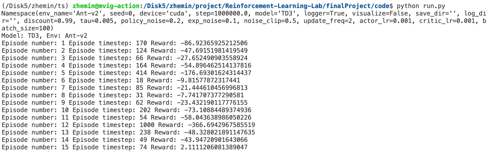

# Reinforcement Learning Final Project

#### 519021910913 黄喆敏

### Directory Structure

```shell
finalProject
├── README.md
├── code
│   ├── policy_based
│   │   ├── PolicyBased.py 
│   │   ├── SoftmaxTD3.py      // improved softmax version of TD3
│   │   ├── TD3.py             // vanilla TD3
│   │   └── buffer.py
│   ├── run.py
│   └── value_based
│       ├── DQN.py             // Dueling DQN
│       ├── ValueBased.py
│       ├── atari_wrappers.py  // used by Gym Atari
│       ├── buffer.py          // prioritized replay buffer
│       └── train.py
├── result                     // training result 
│   ├── Ant-v2_DDPG_reward.json
│   ├── Ant-v2_improved_reward.json
│   ├── Ant-v2_reward.json
│   ├── BoxingNoFrameskip-v4_reward.json
│   ├── BreakoutNoFrameskip-v4_reward.json
│   ├── HalfCheetah-v2_reward.json
│   ├── Hopper-v2_reward.json
│   ├── Humanoid-v2_reward.json
│   ├── PongNoFrameskip-v4_reward.json
│   └── pics
│       ├── Ant-v2-improved.jpg
│       ├── Ant-v2.jpg
│       ├── Ant-v2_improved.jpg
│       ├── BoxingNoFrameskip-v4.jpg
│       ├── BreakoutNoFrameskip-v4.jpg
│       ├── HalfCheetah-v2.jpg
│       ├── Hopper-v2.jpg
│       ├── Humanoid-v2.jpg
│       ├── PongNoFrameskip-v4.jpg
│       ├── comparison.png
│       ├── draw.py
│       └── example.png
└── video                    // video exported by gym.monitor
    ├── Ant-v2.mp4
    ├── BoxingNoFrameskip-v4.mp4
    ├── BreakoutNoFrameskip-v4.mp4
    ├── HalfCheetah-v2.mp4
    ├── Hopper-v2.mp4
    ├── Humanoid-v2.mp4
    └── PongNoFrameskip-v4.mp4
```

### Training Environment

- GPU: NVIDIA TITAN Xp
- Operating System: Linux
- Python: 3.9
- PyTorch: 1.11.0
- Gym: 0.19.0
- Tensorboard: 2.9.0 
- Mujoco-py: 2.0.2.8
- Atari: 0.2.6
- Opencv-python: 4.5.5.64

In order to boost the training speed, I have trained models on a remote Linux server, using one GPU per time.

**It is highly recommended that we should run the code on Linux platform**, because MuJoCo is no longer supported officially on Windows, and there are a lot of incompatibility problems when I installed it on Windows.

Please aware that `gym==0.19.0 && atari==0.2.6` is a very good combination, which can avoid a lot of uncessary problems. 

Besides, if you want to visualize the result, `gym` version should lower than `0.22.0`, because `gym.Monitor`  has been deprecated in the following version.

For MuJoCo library, you may find that in a lot of tutorials, you are told to apply for a license. However, due to MuJoCo being opensource, you only need to install a version after 200, and there is no need to apply for a license.

For Atari tasks, we may use APIs like `wrap_deepmind`. Therefore, I have put `atari_wrappers.py` in the `code` directory, to prevent the loss of runtime library.

### Usage

Firstly, please make sure that the python packages above have been installed in a conda environment. Then you should activate that virtual environment.

For policy-based methods, we support TD3 and TD3 with softmax operator. For value-based methods, we support DQN with prioritized replay and multi-step learning.

For both value-based and policy-based methods, we have used the same interface. The arguments will be parsed in `run.py`, then it will go to a specified model for training.

```python
def get_args():
    parser = argparse.ArgumentParser()
    parser.add_argument("--env_name",
                        type=str,
                        default="Ant-v2",
                        choices=["BreakoutNoFrameskip-v4", "PongNoFrameskip-v4",
                                 "BoxingNoFrameskip-v4", "Hopper-v2", "Humanoid-v2", "HalfCheetah-v2", "Ant-v2"])
    parser.add_argument("--seed", type=int, default=0)
    parser.add_argument(
        "--device", type=str, default="cuda" if torch.cuda.is_available() else "cpu"
    )
    parser.add_argument("--step", type=int, default=int(1e6))
    parser.add_argument("--model", type=str, default="TD3")
    parser.add_argument("--logger", type=bool, default=True)
    parser.add_argument("--visualize", type=bool, default=False)
    parser.add_argument("--save-dir", default="", type=str)
    parser.add_argument("--log-dir", default="", type=str)

    parser.add_argument("--discount", default=0.99, help='Discount factor')
    parser.add_argument("--tau", default=0.005, help='Target network soft update')
    parser.add_argument('--policy-noise', default=0.2, type=float, help='Policy update noise')
    parser.add_argument("--exp-noise", default=0.1, type=float, help='Gaussian exploration noise')
    parser.add_argument('--noise-clip', default=0.5, type=float, help='Clip target policy noise')
    parser.add_argument("--update-freq", default=2, type=int, help='Frequency of delayed policy updates')
    parser.add_argument('--actor-lr', default=1e-3, type=float)
    parser.add_argument('--critic_lr', default=1e-3, type=float)
    parser.add_argument('--batch-size', default=32, type=int)
    
    parser.add_argument('--num-frames', default=500000)

    # used only for value-based methods
    parser.add_argument('--lr', default=1e-4, type=float)
    parser.add_argument('--buffer-size', default=int(1e6), type=int)

    return parser.parse_args()
```

For example, if you want to run `Ant-v2`  with `TD3`, `seed=1024`, then  the command should look like this:

```bash
python run.py --env_name Ant-v2 --model TD3 --seed 1024
```

If the program runs successfully, the result should look like this:




### Visualization

If you want to use a remote server for visualization, please install `xvfb` package, and execute `xvfb-run -s "-screen 0 1400x900x24" jupyter notebook`, which will generate a fake screen for visualization. 

Then you can run the program in the jupyter notebook, and generate video as result.

### Reference

[1] https://zhuanlan.zhihu.com/p/412436689
[2] https://www.cnblogs.com/cenariusxz/p/12666938.html
