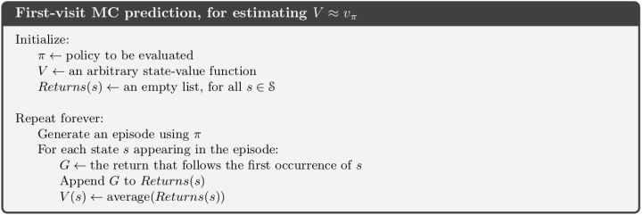
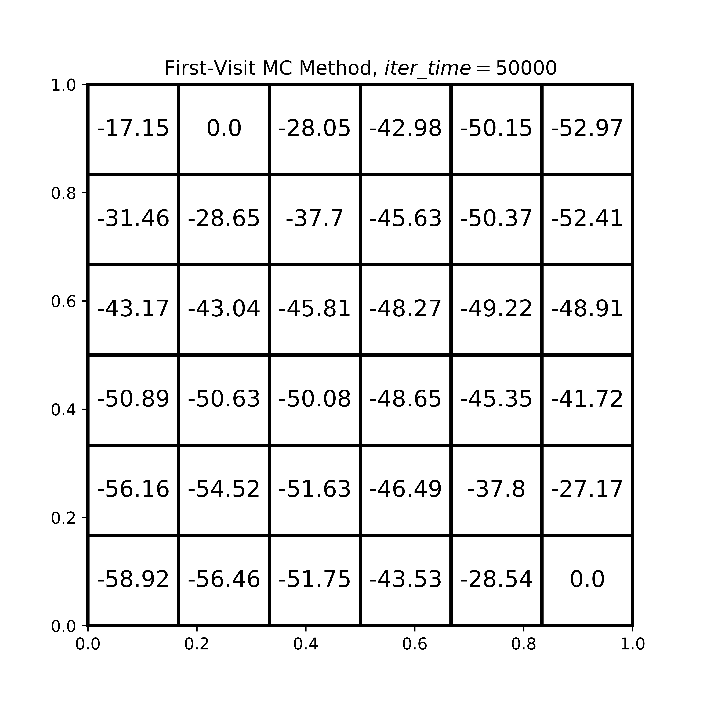
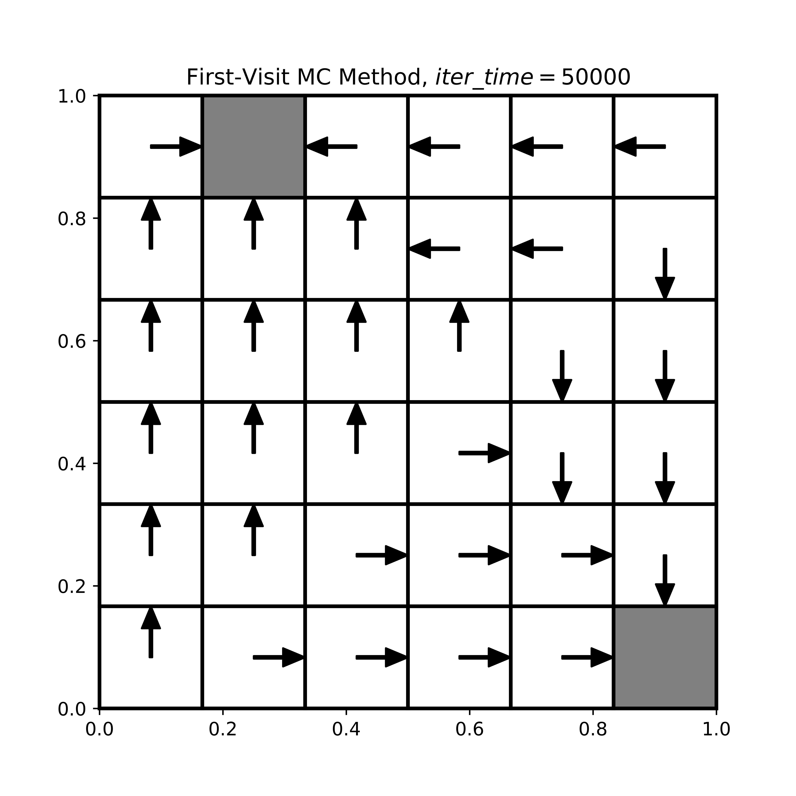
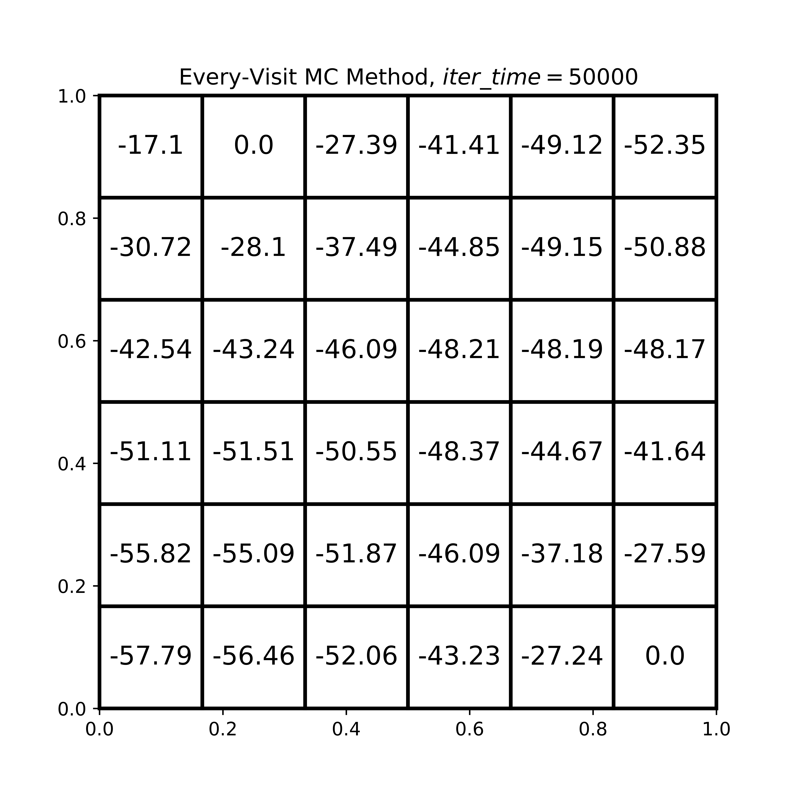
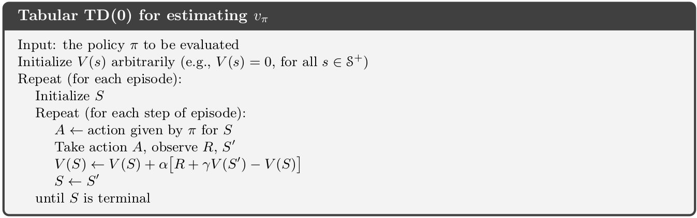
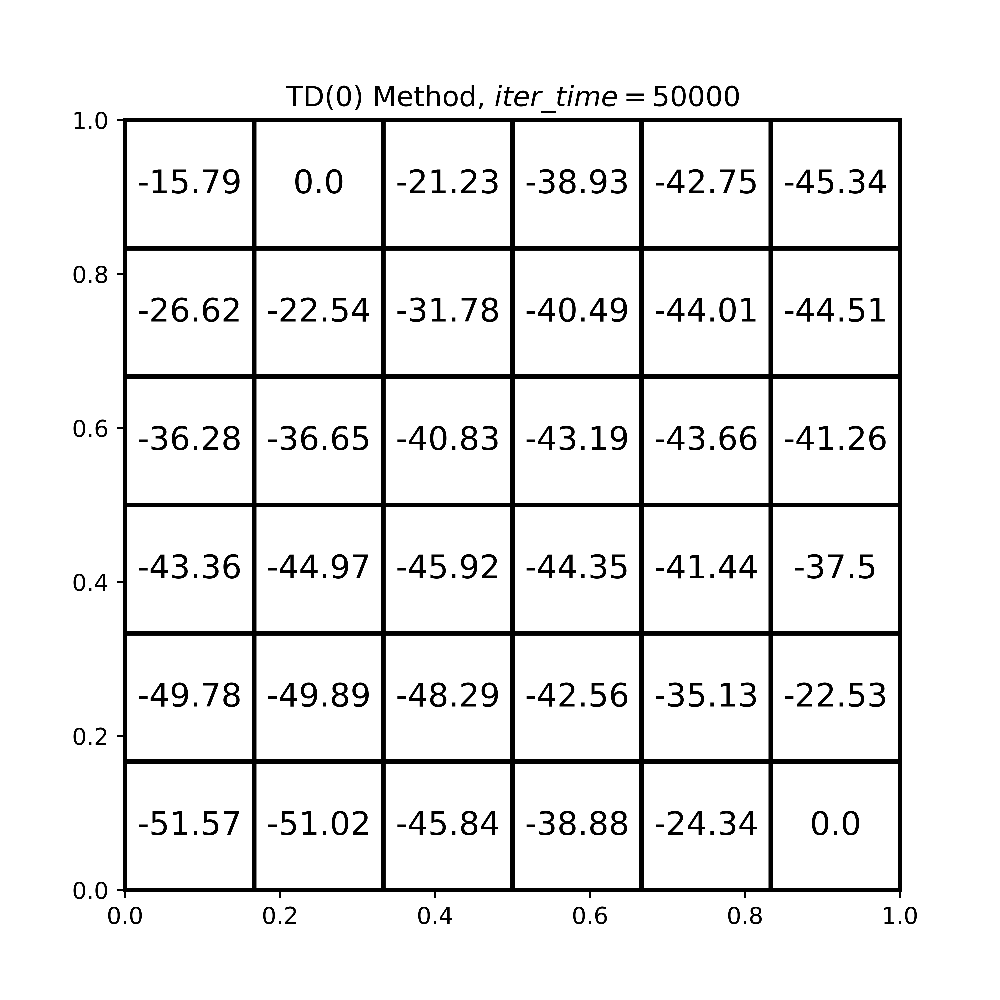

# Report for Assignment 2

### 519021910913 黄喆敏

### Directory Structure

````
lab2
├── code
│   ├── GridWorld.py	
│   ├── MC.py											# Monte-Carlo Methods
│   └── TD.py											# TD(0) Method
└── docs
    ├── assets										# images for report
    │   ├── TD_policy.png
    │   ├── TD_value.png
    │   ├── every_visit_policy.png
    │   ├── every_visit_value.png
    │   ├── first_visit.jpg
    │   ├── first_visit_policy.png
    │   ├── first_visit_value.png
    │   └── td0.jpg
    ├── report.md
    └── report.pdf
````

All codes are placed in `./code` directory. To run the code, you can either run `MC.py`, or `TD.py`, in which I have implemented two methods separately.

### GridWorld
Class `GridWorld` provides some function that can be used in both methods and includes some basic parameters, such as `terminal`, `discount factor`, `reward`, etc. we also use `matplotlib` library to visualize the results of action. Details can be seen in code.

Besides, we use `generate_episode` function to generate random episodes for both methods.

```python
def generate_episode(self):
    res = []
    now_x = random.randint(0, self.n - 1)
    now_y = random.randint(0, self.m - 1)
    gain = 0
    while True:
        res.append({'pos': (now_x, now_y), 'gain': gain})
        action = self.action[random.randint(0, 3)]
        if self.is_terminal(now_x, now_y):
            gain += 1
            break
        # if not in bound, remain in the current position    
        if self.in_bound(now_x + action[0], now_y + action[1]):  
            now_x += action[0]
            now_y += action[1]
        gain -= 1
    return res, gain
```

### First-visit Monte-Carlo Method

In First-visit Monte-Carlo Method, we randomly generate episodes and use the average result.



It is convenient to **convert the mean return into an incremental update**, so that the mean can be updated with each episode, and we can understand the progress made with each episode. We update $v(s)$ incrementally after episodes. 

For each state $ S_t $ with return $ G_t$，

​															$$ N(S_t) \gets N(S_t)+1 $$

​															$$ V(S_t) \gets V(S_t) + \frac{1}{N(S_t)}(G_t-V(S_t)) $$

In order to guarantee the stability of the MC method, we set the iteration time to **50000**. Actually, the algorithm also works well under lower iteration time. 

```python
def first_visit(self, iter_time=100000):
    self.gridworld.clear()
    for i in range(iter_time):
        episode = self.gridworld.generate_episode()
        # for first visit, we should remove duplicated items
        vis = np.zeros((self.gridworld.n, self.gridworld.m))  
        total_gain = episode[-1]['gain'] + 1
        for item in episode:
            pos = item['pos']
            gain = total_gain - item['gain']
            if self.gridworld.is_terminal(pos[0], pos[1]) or vis[pos[0], pos[1]] is True:
                continue
            vis[pos[0], pos[1]] = True
            self.gridworld.num[pos] += 1
            self.gridworld.value[pos] += 
            (1 / self.gridworld.num[pos]) * (gain - self.gridworld.value[pos])
```

Here is the result.





### Every-visit Monte-Carlo Method

The every-visit MC method is very similar to the first-visit MC Method. The difference is that for every-visit method, we can update the same state twice, while we can only update the same state once in first-visit method. 

We still set the iteration time to **50000**. The following images are the result for every-visit method. We can see that the value matrixes are quite similar, and both methods have achieved optimal policy.




### TD(0) Method

Unlike Monte-Carlo methods, TD methods learn directly from episodes of experience.The TD(0) method is implemented based on the following pseudocode.



```python
def work(self, iter_time=10000, alpha=0.1, gamma=1.0):
    self.gridworld.clear()
    for i in range(iter_time):
        episode = self.gridworld.generate_episode()
        for idx in range(1, len(episode)):
            item = episode[idx - 1]['pos']
            next_item = episode[idx]['pos']
            now_value = self.gridworld.value[item[0], item[1]]
            next_value = self.gridworld.value[next_item[0], next_item[1]]
            gain = -1
            if item == next_item:
                gain = 0
            self.gridworld.value[item[0], item[1]] = now_value + 
            alpha * (gain + gamma * next_value - now_value)
```

$\alpha$ and $\gamma$ are two hypermeters, and $\alpha \in [0,1)$, $ \gamma \in [0,1) $.  We have tried some combinations of hypermeters and compared their results. Finally, we set $\alpha=0.1, \gamma=1.0$.  Besides, the iteration time remains the same. in order to compare the results of MC and TD methods. The result is as follows.




### Comparison

For both MC and TD(0) methods, they are both model-free methods.  But TD(0) method can learn after every step, while MC method requires a full episode to update value evaluation. 

In our implementation, both methods have achieved the optimal policy.  But TD(0) method converges more quickly than Monte Carlo methods.

