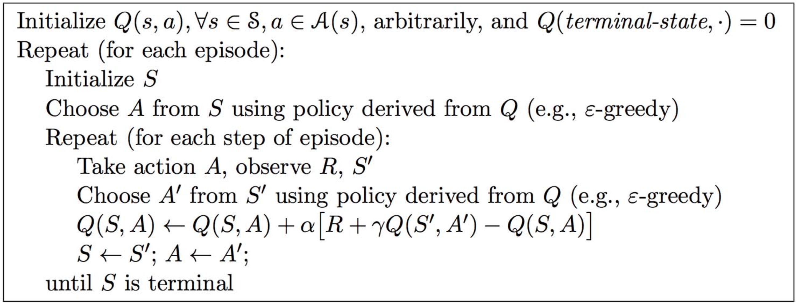
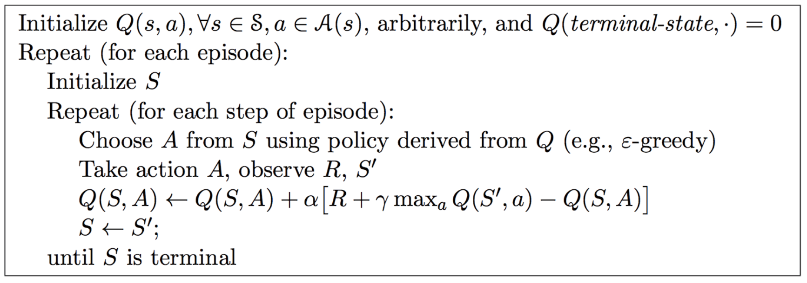

# Report for Assignment 3

### 519021910913 黄喆敏

### Directory Structure

````
lab3
├── code
│   ├── GridWorld.py	
│   ├── MC.py											# Monte-Carlo Methods
│   └── TD.py											# TD(0) Method
└── docs
    ├── assets										# images for report
    │   ├── TD_policy.png
    │   ├── TD_value.png
    │   ├── every_visit_policy.png
    │   ├── every_visit_value.png
    │   ├── first_visit.jpg
    │   ├── first_visit_policy.png
    │   ├── first_visit_value.png
    │   └── td0.jpg
    ├── report.md
    └── report.pdf
````

All codes are placed in `./code` directory. To run the code, you can either run `MC.py`, or `TD.py`, in which I have implemented two methods separately.


### Cliff Walking


### SARSA Method

For SARSA method, the algorithm can be given as follows. It is important that while updating the policy, the same policy is used.




### Q-learning Method



