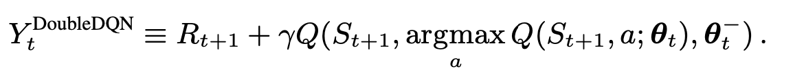
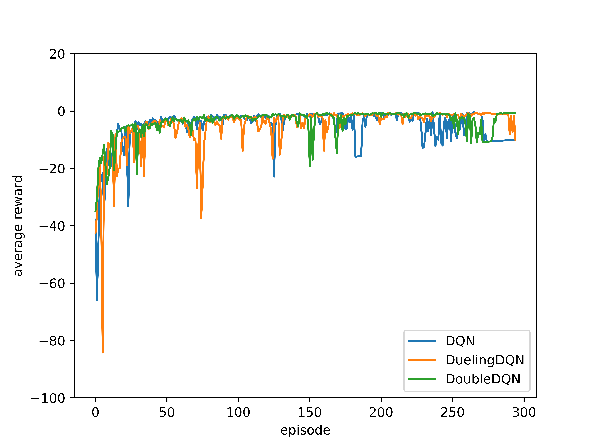
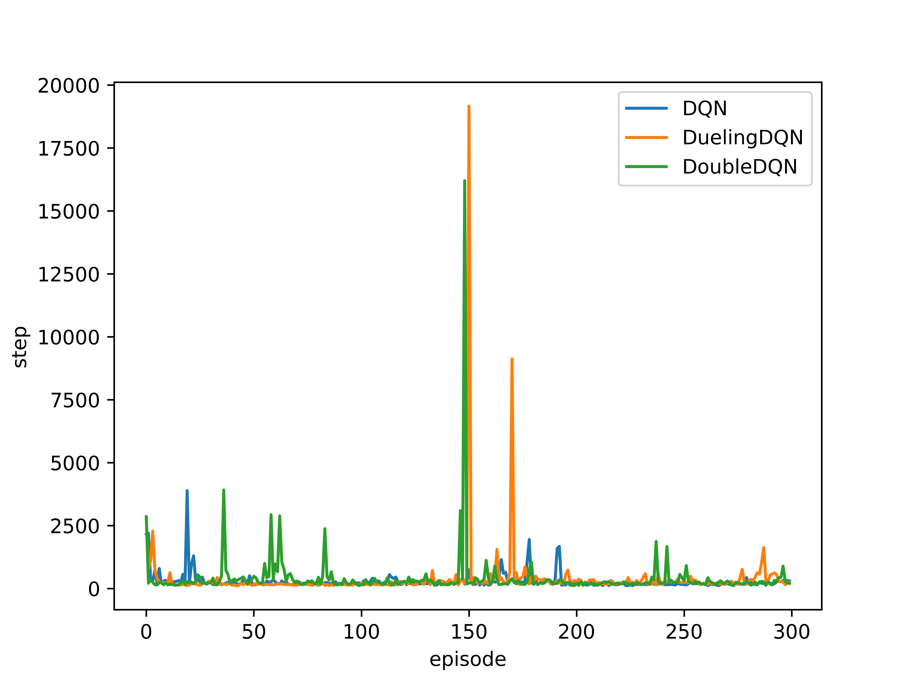
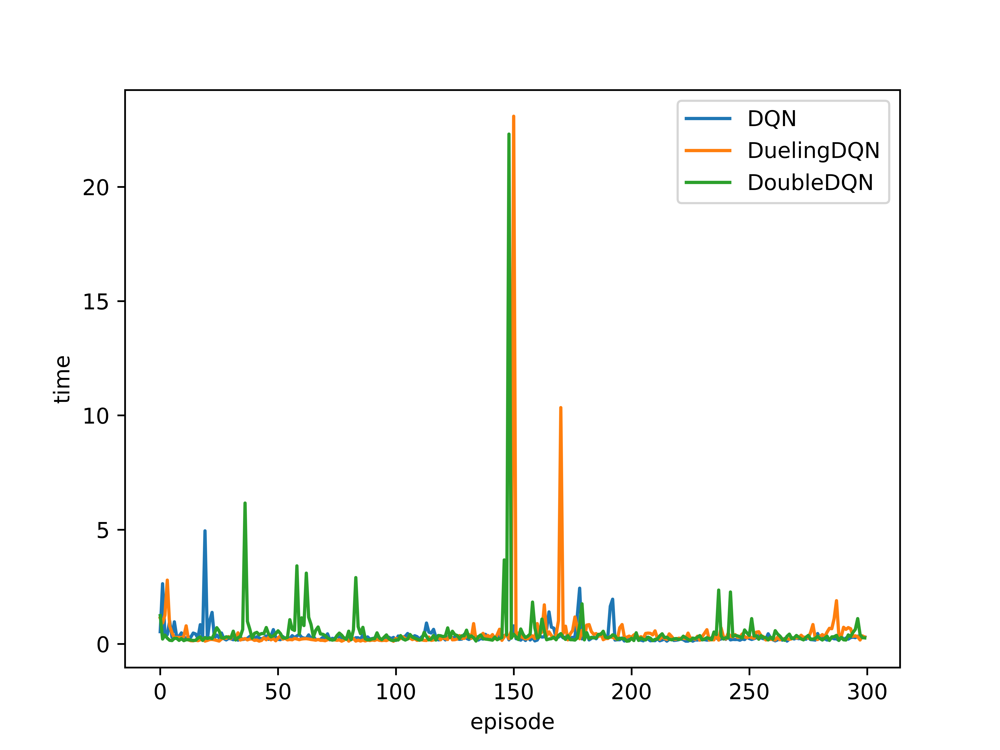

# Report for Assignment 4

### 519021910913 黄喆敏

### Directory Structure

````
lab4
├── code
│   ├── DDQN.py           			#  Double DQN model
│   ├── DQN.py            			#  DQN model
│   ├── DuelingDQN.py    			  #  Dueling DQN model
│   ├── Train.py                #  call DQN model to train
│   └── main.py                 #  external interface
└── docs
    ├── assets
    │   ├── avg_reward.png
    │   ├── double_dqn.png
    │   ├── dqn.png
    │   ├── dueling_dqn.png
    │   ├── step.png
    │   └── time.png
    └── report.md
````

All codes are placed in `./code` directory. You can directly run `main.py` to see the results of three DQN-based models.

 If you want to visualize the result of `MountainCar`, modify `self.visual` to `true`.

The package requirement is as follows:

- PyTorch 1.11.0. We don't have to install `cuda` , because the neural network is not very deep and we don't need to use GPU.
- Python >= 3.7.0
- gym 0.23.1
- pygame 2.1.2. If you want to visualize the result of `MountainCar`, please install it.


### Introduction

In this assignment, I have implemented the DQN algorithm and its improved algorithms. I have chosen **Double DQN** and **Dueling DQN**, because they are easy to be written and strong as well. 

We test all the results in a classical RL control environment: `MountainCar`, provided by OpenAI gym. In `train.py`, we import the environment and do training.

```python
class Train:
    def __init__(self, category, iter_time=1000, visual=False):
        self.category = category
        self.iter_time = iter_time
        self.visual = visual

    def train(self):
        memory_size = 2000
        env = gym.make('MountainCar-v0').unwrapped
        torch.manual_seed(2022)  # in order to reproduce the result

        dpn = None
				......            			# choose dqn model

        episode_step = []
        episode_time = []
        avg_reward = []

        for i in range(self.iter_time):
            start_time = time.time()
            s = env.reset()
            total_reward = 0
            num = 0
            while True:
                if self.visual:
                    env.render()

                a = dqn.move(s)
                s_, reward, done, info = env.step(a)
                
                reward_ = calc_reward(s_[0])
                dqn.save_buffer(s, a, reward_, s_)
                total_reward += reward
                s = s_

                if dqn.memory_counter > memory_size:
                    dqn.learn()
                    num += 1
                ......    
        return episode_step, episode_time, avg_reward
```


### Vanilla DQN

In previous assignment, we have implemented **Q-Learning**. The only difference between Q-learning and DQN is the agent’s brain. The agent’s brain in Q-learning is the Q-table, but in DQN, the agent’s brain is a deep neural network.

The idea proposed by Mnih et al. <sup><a href="#ref1">[1]</a></sup>  solves the problem of correlated input/outputs and is actually quite simple: instead of feeding successive transitions into a minibatch and immediately training the NN on it, transitions are stored in a huge buffer called **replay buffer**. When the buffer is full, new transitions replace the old ones.


#### Neural Network

In the original paper, the authors use serveral convolutional layers to **extract features** from Atari frames. However, in `MountainCar` environment, states are abstracted as *position* and *velocity*. ( You can see the definition in source code of gym). Thus, there is no need to use convolutional layers. 

In my implementation, neural net for DQN is composed of three linear layers, activated by `ReLU` functions. As usual, we use `Adam` for optimizers and `Mean Square Loss` for loss function.  It seems that it works better than `Cross Entropy Loss`.

For the size of linear layers, I have tried 16, 32, 64. It turns out that there is little difference for this task.

```python
class Net(nn.Module):
    def __init__(self, state_num=2, action_num=3):
        super(Net, self).__init__()

        self.model = nn.Sequential(
            nn.Linear(state_num, 16),
            nn.ReLU(),
            nn.Linear(16, 16),
            nn.ReLU(),
            nn.Linear(16, action_num)
        )

    def forward(self, x):
        return self.model(x)
```


### Reward Function

The original reward function is very simple. If the agent doesn't arrive the top, reward=-1. However, for the right position, we should give it higher reward than the left position. 

Besides, the left position should be given a negative reward.

For position close to the middle, the reward should be positive but much smaller than the biggest reward.

It turns out that the modifed version of reward function converges faster than the original one.

```python
def calc_reward(pos):
    if pos >= 0.5:
        return 100
    elif pos <= -0.5:
        return -1
    else:
        return (10 * (pos + 0.5)) ** 2
```


### Double DQN

One of the problems of the DQN algorithm is that **it overestimates the true rewards**. The Q-values think the agent is going to obtain a higher return than what it will obtain in reality.

To fix this, the authors of the **Double DQN algorithm** <sup><a href="#ref3">[3]</a></sup> suggest using a simple trick: **decoupling the action selection from the action evaluation**. Instead of using the same Bellman equation as in the DQN algorithm, 



First, the main neural network θ decides which one is the best next action a’ among all the available next actions, and then the target neural network evaluates this action to know its Q-value. This simple trick has shown to **reduce overestimations**, which results in better final policies.

The following code shows the difference between Double DQN and Vanilla DQN:

```python
class DDQN:
		......
    def learn(self):
    		......
        # difference between DQN and DDQN
        q_eval_ = self.eval_net(state).detach()
        q_next = q_eval_.gather(1, torch.max(q_eval_, 1)[1].unsqueeze(1)).squeeze(1)
        mx = q_next.reshape(self.batch_size, 1)
        # set y_j = r_j + gamma*max
        q_target = reward + self.discount * mx
        loss = self.loss(q_eval, q_target)

        self.optimizer.zero_grad()
        loss.backward()
        self.optimizer.step()
        
```


### Dueling DQN

The thought of Dueling DQN algorithm <sup><a href="#ref2">[2]</a></sup> is quite simple. The algorithm **splits the Q-values in two different parts, the value function $V(s)$ and the advantage function $A(s, a)$.** This is particularly useful for states where their actions do not affect the environment in a relevant way. 

Moreover, **the advantage function has less variance than the Q-values**, which is a very good property when using neural networks for function approximation. 


The implementations of Dueling DQN and Vanilla DQN are quite similar. The only difference lies in the neural network part. 

For Dueling DQN, we first need to separate the state value $V(s)$ and advantage function $A(s,a)$. And then we combine both through an aggregation layer to get an estimate of $Q(s,a)$.

```python
class Net(nn.Module):
    def __init__(self, state_num=2, action_num=3):
        super(Net, self).__init__()

        self.features = nn.Sequential(
            nn.Linear(state_num, 16),
            nn.ReLU(),
            nn.Linear(16, 16),
            nn.ReLU(),
        )

        self.advantage = nn.Linear(16, action_num)
        self.value = nn.Linear(16, 1)

    def forward(self, x):
        y = self.features(x)
        advantage = self.advantage(y)
        value = self.value(y)

        return value + advantage - advantage.mean()
```


### Parameters & Training Process

The three models share the same following hyperparameters, in order to better test the model itself.

- *learning_rate* = 0.01.
- *memory_size* = 2048, used in *Replay Buffer* policy.
- $\epsilon=0.9$, used in $\epsilon-greedy$ algorithm.
- *update_iter* = 25. For each 25 iterations, we use the latest parameters of Q Network to update the target   net.
- *epoch* = 300.
- *batch_size* = 32 for sampling.


### Experiment Result

I have tested three models for 300 *epochs*. For three models, they can arrive to the top in most cases. 

**The average reward** for Double DQN is higher than Vanilla DQN. Double DQN is more stable as well. Also, it takes more time for Double DQN to converge but leads to a better result. However, for Double DQN, I find that the model may perform worse if it is trained for too many episodes. 

**The steps in episode of Dueling DQN is less than DQN's and Double DQN's**. However, Dueling DQN is **less stable** than the other two method. In some episodes, it needs much more steps to arrive the destination.



<center style="color:#C0C0C0;text-decoration:underline">Average Reward</center>




<center style="color:#C0C0C0;text-decoration:underline">Steps for Each Episode</center>



<center style="color:#C0C0C0;text-decoration:underline">Training Time for Each Episode</center>


### Conclusion

In this assignment, I have learned and implemented three DQN-based methods. Also, I am more familiar with Pytorch and Gym library. This assignment is a challenging one, but I have gained a lot in the process of tuning the parameters and training networks.


### References

<a name="ref1">[1]</a> Mnih, Volodymyr, et al. "Playing atari with deep reinforcement learning." *arXiv preprint arXiv:1312.5602* (2013).

<a name="ref2">[2]</a> Wang, Ziyu, et al. "Dueling network architectures for deep reinforcement learning." *International conference on machine learning*. PMLR, 2016.

<a name="ref3">[3]</a> Van Hasselt, Hado, Arthur Guez, and David Silver. "Deep reinforcement learning with double q-learning." *Proceedings of the AAAI conference on artificial intelligence*. Vol. 30. No. 1. 2016.

[4] https://gym.openai.com/evaluations/eval_x8bljbC7S3SOvhOVKNA9Q/

[5] https://zhuanlan.zhihu.com/p/336723691

