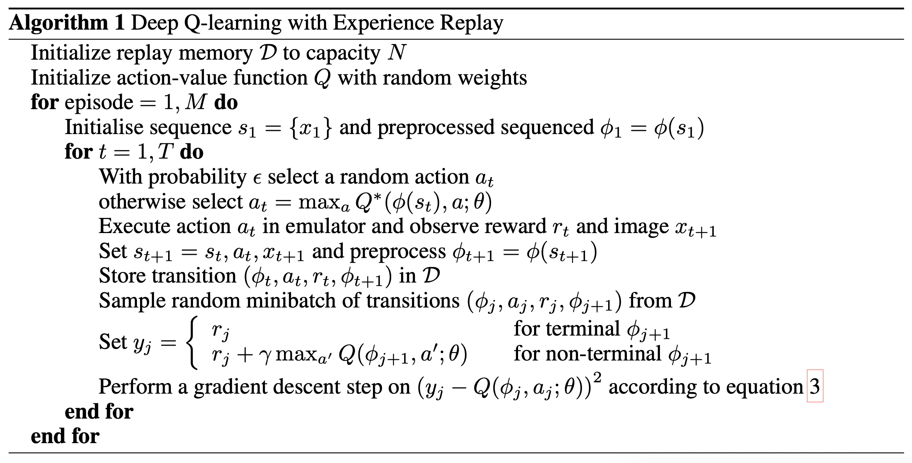
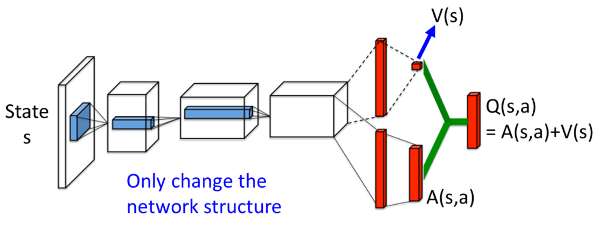

# Report for Assignment 4

### 519021910913 黄喆敏

### Directory Structure

````
lab3
├── code
│   ├── CliffWalking.py
│   ├── QLearning.py
│   ├── Sarsa.py
│   └── main.py
└── docs
    ├── assets
    │   ├── eps_0.png							# comparison between SARSA and Q-Learning
    │   ├── eps_1.png
    │   ├── eps_2.png
    │   ├── heatmap								# heatmap of Q matrix
    │   │   ├── q_learning_0.png
    │   │   ├── q_learning_1.png
    │   │   ├── q_learning_2.png
    │   │   ├── sarsa_0.png
    │   │   ├── sarsa_1.png
    │   │   └── sarsa_2.png
    │   ├── policy							  # policy generated by SARSA and Q-Learning
    │   │   ├── q_learning_0.png
    │   │   ├── q_learning_1.png
    │   │   ├── q_learning_2.png
    │   │   ├── sarsa_0.png
    │   │   ├── sarsa_1.png
    │   │   └── sarsa_2.png
    │   ├── qlearning.png
    │   └── sarsa.png
    └── report.md
````

All codes are placed in `./code` directory. You can directly run `main.py` to observe the results of SARSA and Q-Learning methods.


### Introduction


### DQN




#### Neural Network

In the original paper, the authors use serveral convolutional layers to extract features from Atari frames. However, in `MountainCar` environment, states are abstracted as *position* and *velocity*. Thus, there is no need to use convolutional layers. In my implementation, 


### Double DQN

One of the problems of the DQN algorithm is that **it overestimates the true rewards**. The Q-values think the agent is going to obtain a higher return than what it will obtain in reality.

To fix this, the authors of the **Double DQN algorithm** <sup><a href="#ref3">[3]</a></sup> suggest using a simple trick: **decoupling the action selection from the action evaluation**. Instead of using the same Bellman equation as in the DQN algorithm, they change it like this:


First, the main neural network θ decides which one is the best next action a’ among all the available next actions, and then the target neural network evaluates this action to know its Q-value. This simple trick has shown to **reduce overestimations**, which results in better final policies.


### Dueling DQN

The thought of Dueling DQN algorithm <sup><a href="#ref2">[2]</a></sup> is quite simple. The algorithm **splits the Q-values in two different parts, the value function V(s) and the advantage function A(s, a).**



### Conclusion


### References

<a name="ref1">[1]</a> Mnih, Volodymyr, et al. "Playing atari with deep reinforcement learning." *arXiv preprint arXiv:1312.5602* (2013).

<a name="ref2">[2]</a> Wang, Ziyu, et al. "Dueling network architectures for deep reinforcement learning." *International conference on machine learning*. PMLR, 2016.

<a name="ref3">[3]</a> Van Hasselt, Hado, Arthur Guez, and David Silver. "Deep reinforcement learning with double q-learning." *Proceedings of the AAAI conference on artificial intelligence*. Vol. 30. No. 1. 2016.

[4] https://gym.openai.com/evaluations/eval_x8bljbC7S3SOvhOVKNA9Q/

