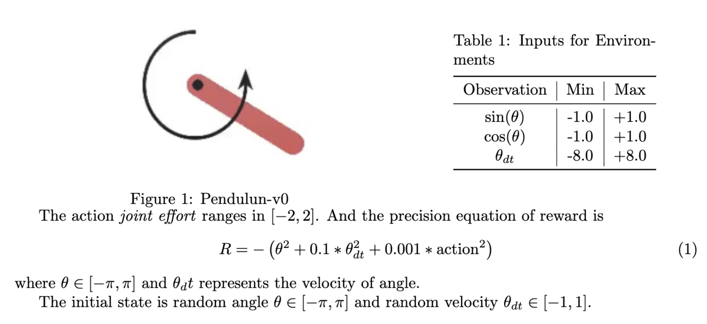
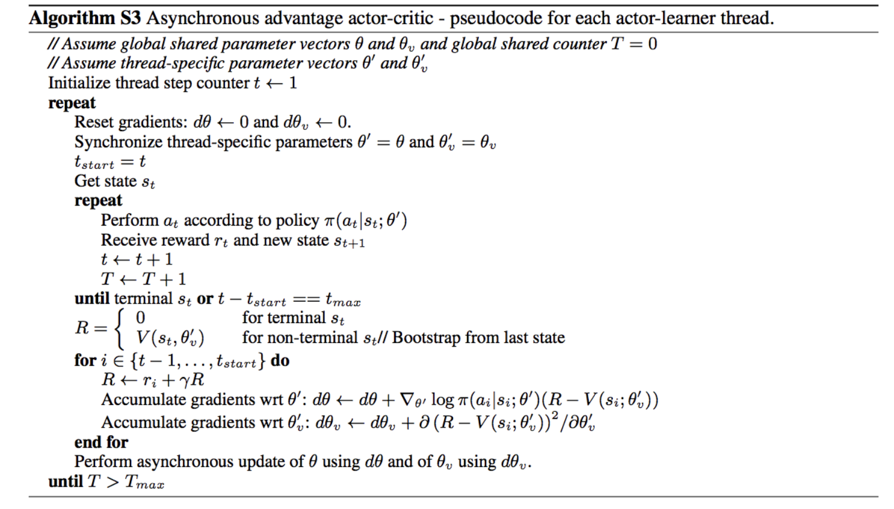
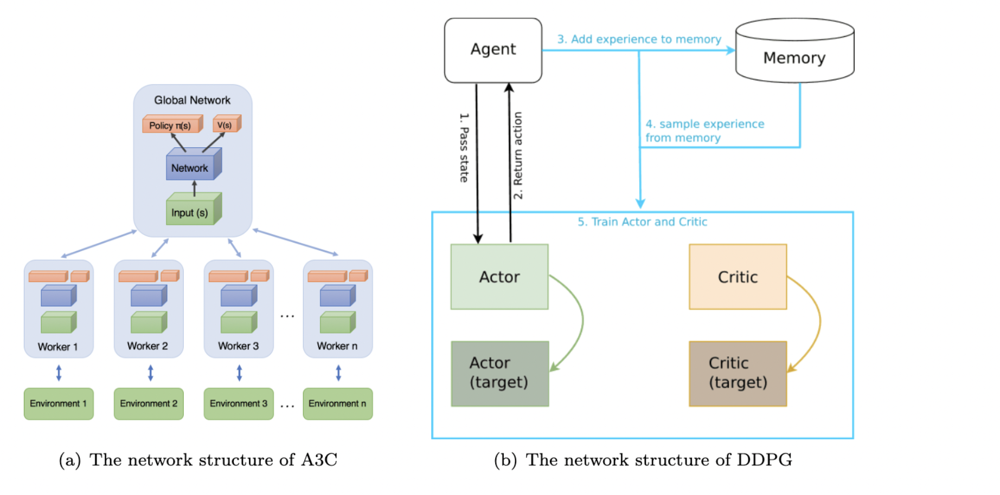

## A3C

### 1   Introduction

Actor-Critic method reduces the variance in Monte-Carlo policy gradient by directly estimating the action-value function. In this assignment, we use two improved AC methods – Asynchronous Advantage Actor-Critic (A3C) and Deep Deterministic Policy Gradient (DDPG) to solve problem with continuous and high-dimension action space.

### 2   Environment: Pendulum-v1

The goal is to swing a frictionless pendulum upright so it stays vertical, pointed upwards. It starts in a random position every time and it doesn't have a specified reward threshold nor at which the episode will terminate.

### 3   Algorithm

#### A3C

A3C is Asynchronous Advantage Actor Critic, which is the optimization of Actor-Critic algorithm. It will create multiple parallel environment, let agents update the parameters in the main structure at the same time. The agents in parallel do not interfere with each other.

### 4   Setting

#### A3C

In A3C, we train 5000 episodes to observe the performance of A3C and for each episode the maximum steps is 200. As for me, the number of concurrent threads is 8, which is also the amount of workers. The learning rate of both networks are 10^-4^ , the discount factor γ = 0.9

#### 5   Result

#### A3C

The method successfully converged. When we render the environment, we can observe that the pendulum will stay vertical after 1500 episodes. After that value, the moving rewards starts to be stable. There is also a very interesting phenomenon which occurs in A3C that the moving reward will increase a little at the beginning.

### 6   Conclusion

#### References

https://github.com/MorvanZhou/pytorch-A3C

