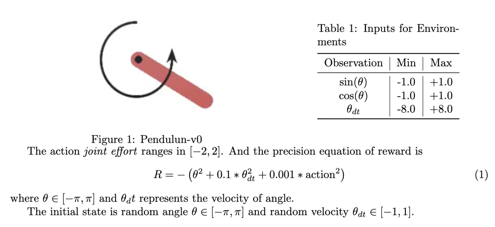
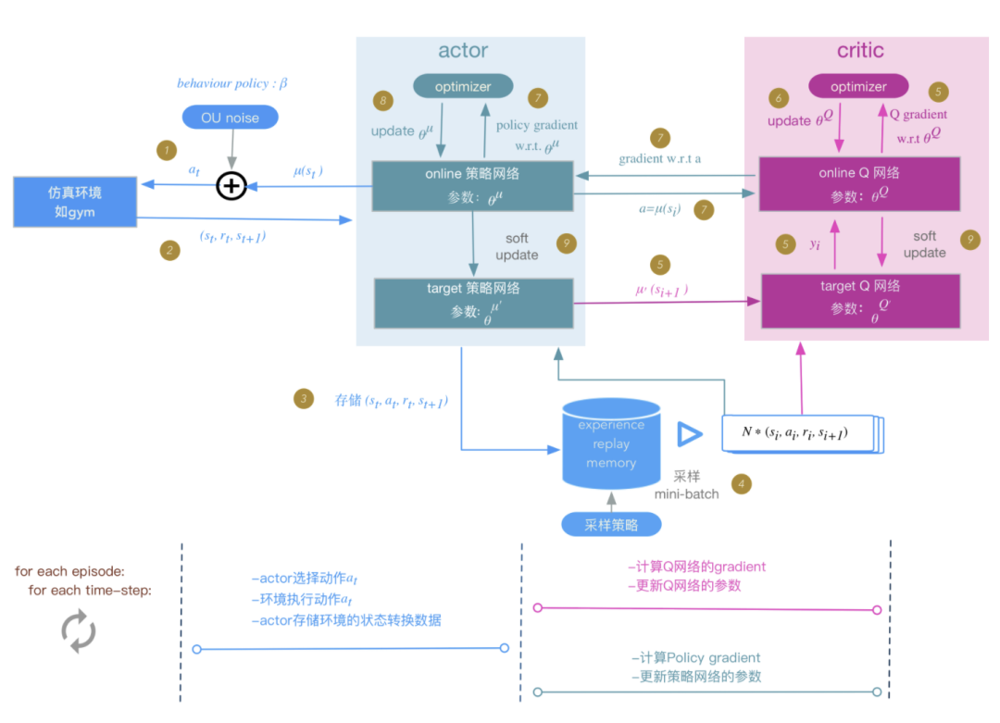
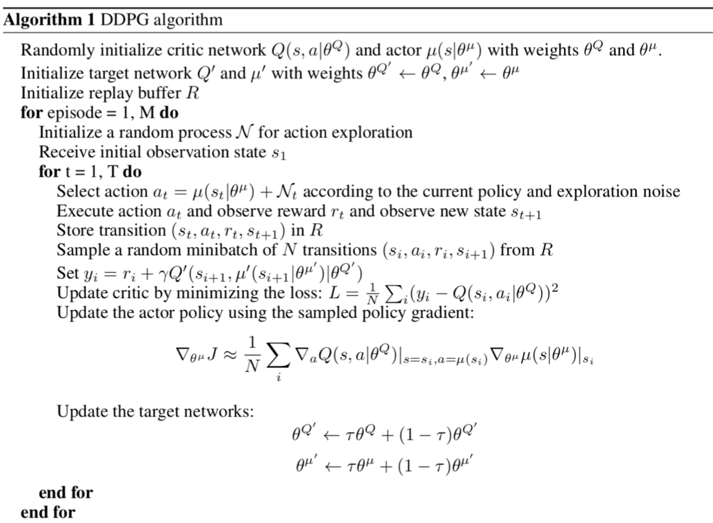
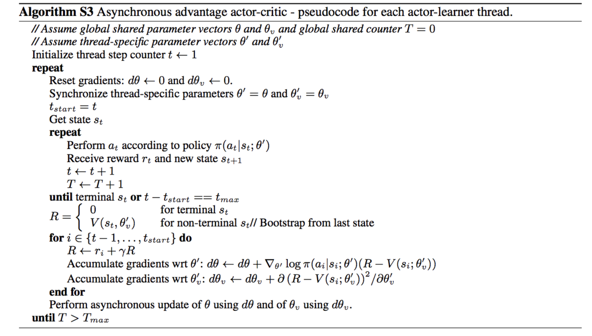
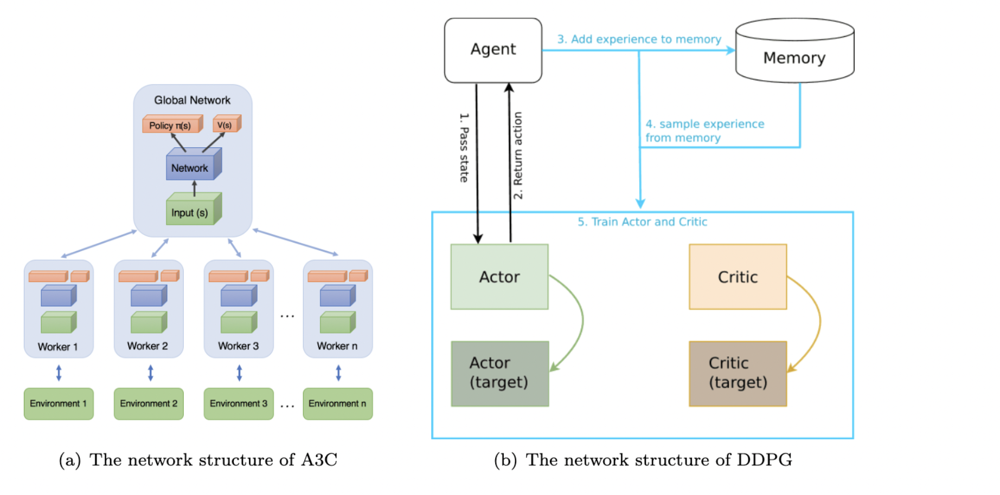
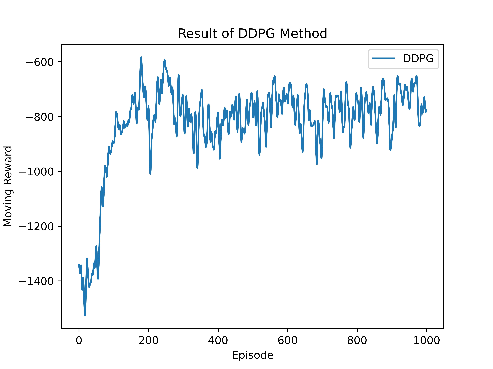
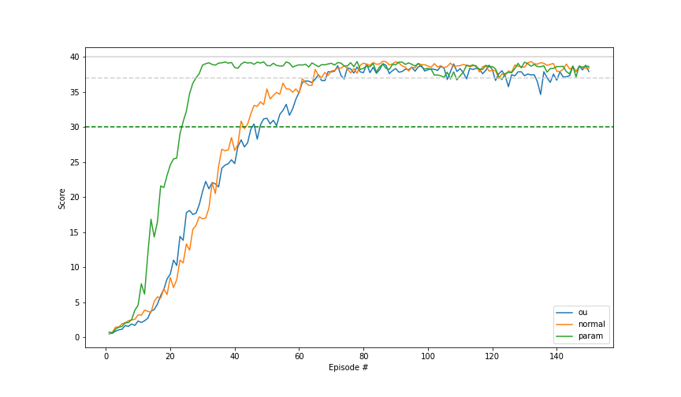
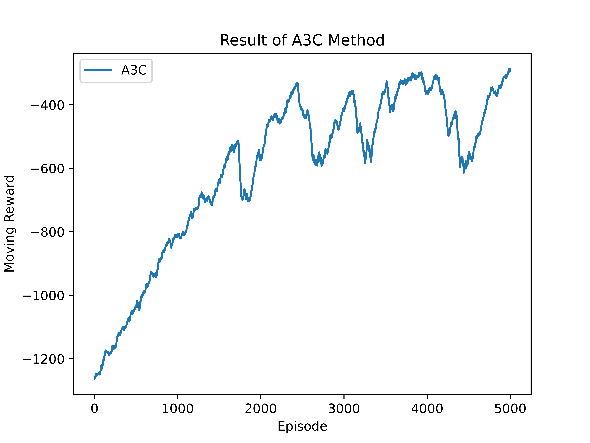
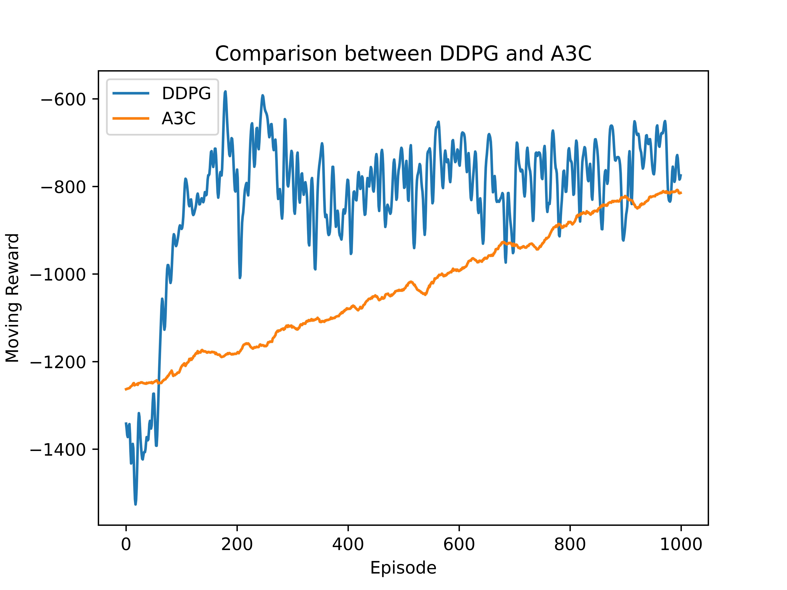

# Report for Assignment 5

#### 519021910913 黄喆敏

#### 519021910914 孙赫誉

## Directory Structure

````bash
lab5
├── code
│   ├── A3C
│   │   ├── A3C.py                #  main function
│   │   ├── Adam.py               #  shared adam for stochastic optimization
│   │   ├── a3c.npy
│   │   └── utils.py
│   └── DDPG
│       ├── agent.py              # agent for training, include soft update
│       ├── buffer.py             # replay buffer
│       ├── ddpg_actor.pth        # checkpoint of networks
│       ├── ddpg_critic.pth
│       ├── ddpg_no_noise.npy
│       ├── ddpg_with_noise.npy
│       ├── main.py               # main function
│       ├── model.py              # actor and critic net
│       ├── noise.py              # Ornstein-Uhlenbeck noise 
│       └── utils.py
├── docs
│   ├── report.pdf
│   ├── assets
│   │   ├── a3c_code.png
│   │   ├── a3c_detail.png
│   │   ├── a3c_result.jpg
│   │   ├── compare_noise.png
│   │   ├── comparison.jpg
│   │   ├── ddpg_code.png
│   │   ├── ddpg_detail.png
│   │   ├── ddpg_result.jpg
│   │   └── environment.png
│   └── report.md
└── result
    └── result.mp4                # visualization
````

All codes are placed in `./code` directory. You can directly run `DDPG/main.py` or `A3C/A3C.py` to see the results of DDPG model or A3C model.

The package requirement is as follows:

- PyTorch 1.11.0. GPU is not important in this assignment, because neural networks in both two methods are not very deep.

- Python >= 3.7.0.

- gym <= 0.22.0.  Since we use gym.Monitor API to export video, the version can not be higher than 0.22.0.

- pygame 2.1.2. 

  

## Introduction

Actor-Critic method reduces the variance in Monte-Carlo policy gradient by directly estimating the action-value function.

In this assignment, we have implemented two improved AC methods – **Asynchronous Advantage Actor-Critic (A3C) and Deep Deterministic Policy Gradient (DDPG)** to solve problem with continuous and high-dimension action space. Besides, we have made some comparisons about these two methods.


## Environment: Pendulum-v1



In this assignment, we have used **Pendulum-v1** environment provided by OpenAI Gym. It is a very classic environment in the control literature.

As shown in figure above, the goal is to swing a frictionless pendulum upright so it stays vertical, pointed upwards. It starts in a random position every time and it doesn't have a specified reward threshold nor at which the episode will terminate.

There are three observation inputs for the environment, whch represents its angle and angular speed. The inputs are shown in table 1.


## Algorithms

### Deep Deterministic Policy Gradient (DDPG)

Deep Deterministic Policy Gradient (DDPG) is an algorithm which concurrently learns a Q-function and a policy. <sup><a href="#ddpg">[2]</a></sup> It uses off-policy data and the Bellman equation to learn the Q-function, and uses the Q-function to learn the policy.

Like DQN, we use **an experience replay buffer** in DDPG to approximate . This is the set  of previous experiences. In order for the algorithm to have stable behavior, the replay buffer should be large enough to contain a wide range of experiences, but **it may not always be good to keep everything**. This may take some tuning to get right.

DDPG also make use of **target networks** similar to DQN. In DQN-based algorithms, the target network is just copied over from the main network every some fixed number of steps. However, DDPG algorithm has made some modifications. The target network is updated once per main network update by polyak averaging, which is also called **soft update** :  $$ {\theta}^{'} =\tau\theta+(1-\tau){\theta}^{'} $$.

DDPG trains a **deterministic policy **in an off-policy way. To make DDPG policies explore better, we add noise to their actions at training time. The authors of the original DDPG paper recommended time-correlated **Ornstein-Uhlenbeck Noise**, but <u>more recent results suggest that uncorrelated, mean-zero Gaussian noise works perfectly well</u>. <sup><a href="#noise">[5]</a></sup> 

<u>In summary, DDPG is a combination of DQN and DPG, and it is an off-policy Actor-Critic based algorithm.</u> The following picture<sup><a href="#ddpg_img">[4]</a></sup> and pseudocode can help you acquire a better understanding of DDPG algorithm.







### Asynchronous Advantage Actor Critic (A3C)

**A3C**, **Asynchronous Advantage Actor Critic**, is a policy gradient algorithm in reinforcement learning that maintains a policy $$\pi(a_t|s_t;\theta)$$ and an estimate of the value function $$V(s_t;{\theta}_v)$$.<sup><a href="#a3c">[1]</a></sup> It operates in the forward view and uses a mix of $$n$$-step returns to update both the policy and the value-function. The policy and the value function are updated after every $$t_{max}$$ actions or when a terminal state is reached.

The critics in A3C learn the value function **while multiple actors are trained in parallel **and get synced with global parameters every so often. The gradients are accumulated as part of training for stability, which is like parallelized stochastic gradient descent.

The algorithm details and its pseudocode are as follows.





## Experiment Details

### DDPG

- We train $$1000$$ episodes to observe the performance of DDPG. For each episode, the maximum step is $$200$$.

- We use Adam for the optimizer. The learning rate of the actor and critic are $$10^{-3}$$ and $$10^{-4}$$ respectively.
- For $$Q$$ we use $$L_2$$ weight decay of $$10^{-2}$$, and use a discount factor of $$\gamma=0.99$$.
- For the soft target updates we use $$\tau=0.001$$.
- For network, We use ReLU to activate all hidden layers, and a tanh layer for the final output layer of the actor. The network has $$2$$ hidden layers with $$400$$ and $$300$$ units. The layer weights and biases of both actor and critic are initialized from a uniform distribution.
- We use an OU process with $$\theta=0.15$$ and $$\sigma=0.3$$.
- We use a replay buffer size of $$10^6$$. The size of minibatch is $$64$$.

### A3C

- We train $$5000$$ episodes to observe the performance of A3C and for each episode the maximum steps is $$200$$. 

- The number of concurrent threads is $$8$$, which is also the amount of workers. 

- The learning rate of both networks are $$10^{-4}$$ , and the discount factor is $$\gamma=0.9$$.


## Result

For DDPG method, We have used `gym.Monitor` library to export video of the final result, which have been put in the `result` directory. For A3C method, you can directly run the code, and watch the visualization through `pygame` window.

### DDPG

The moving reward of each episode for DDPG is as follows. We have used Gaussian Blur to reduce the noise of the result. In our experiment, DDPG converges very fast. After about 200 episodes, the moving reward becomes relatively stable.



Besides, we have also noted that the author used **Ornstein-Uhlenbeck Process** to generate noise. From the author's perspective, <u>it can generate temporally correlated noise in order to explore well in physical environments that have momentum.</u>  But as far as we know, Gaussian Noise/Normal Noise is more commonly used and behaves well. 

Therefore, we have made some comparison. It seems that OU noise doesn't work better than uncorrelated Gaussian noise. But both of them have satisfying results.



### A3C

The method successfully converged. When we render the environment, we can observe that the pendulum will stay vertical after 1500 episodes. After that value, the moving rewards starts to be stable. 

There is also a very interesting phenomenon which occurs in A3C that the moving reward will increase a little at the beginning.



### Comparison

Based on the results above, we have made comparison about two methods based on the rewards of first 1000 episodes.

From the figure below, we can see that **DDPG converges faster than A3C**. DDPG achieves a relative high reward about 150 episodes. But it takes A3C about 1000 episodes to achieve the same reward.

However, **the learning curve of DDPG is much nosier than A3C's**, no matter whether the OU noise is added. Therefore, we can use **TD3** as an optimized version of DDPG, which can make the training process more stable.




## Conclusion

We have introduced and discussed details of A3C and DDPG methods, as well as implementing two methods in the assignment. Both methods are suitable for continuous actions. They can converge quickly and behave well in the given environment. Furthermore, we should also combine some other methods like PPO and DQN when we are faced with environment with discrete actions.


### References

<a name="a3c">[1]</a> Mnih, Volodymyr, et al. "Asynchronous methods for deep reinforcement learning." *International conference on machine learning*. PMLR, 2016.

<a name="ddpg">[2]</a> Lillicrap, Timothy P., et al. "Continuous control with deep reinforcement learning." *arXiv preprint arXiv:1509.02971* (2015).

<a name="text3">[3]</a> Hou, Yuenan, et al. "A novel DDPG method with prioritized experience replay." *2017 IEEE international conference on systems, man, and cybernetics (SMC)*. IEEE, 2017.

<a name="ddpg_img">[4]</a>  https://zhuanlan.zhihu.com/p/111257402

<a name="noise">[5]</a> Kenfack, Lionel Tenemeza, et al. "Decoherence and tripartite entanglement dynamics in the presence of Gaussian and non-Gaussian classical noise." *Physica B: Condensed Matter* 511 (2017): 123-133.

<a name="baseline">[6]</a> https://github.com/openai/baselines

<a name="td3">[7]</a> Fujimoto, Scott, Herke van Hoof, and Dave Meger. “Addressing Function Approximation Error in Actor-Critic Methods.” *arXiv preprint arXiv:1802.09477* (2018).
